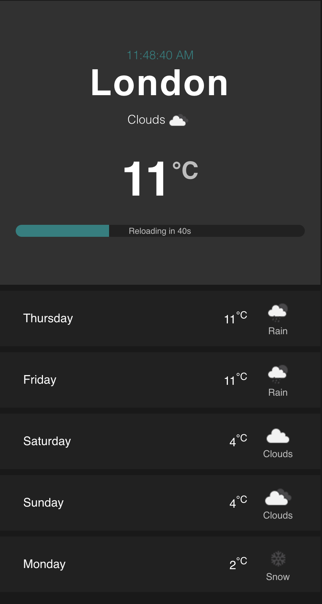

# React Weather App ⛅️ 

React weather app that fetch data from the OpenWeatherMap API and refresh the data every 60 seconds. 🕰 



## Getting started

- Sign up over at [openweathermap.org](https://openweathermap.org/appid) to get an API key.
- Fork the project and clone it locally.
- Create a file at the root of the project called `.env` with the following contents:

```sh
REACT_APP_API_URL = 'https://api.openweathermap.org/data/2.5'
REACT_APP_API_KEY = The API key you obtained from openweathermap.org
REACT_APP_ICON_URL = 'https://openweathermap.org/img/w'
```

## What could be improved further:

If I had more time, I would get more creative with the styling and add more features to the app as follows:
1. Add a search input to check different cities, and get the Geo location of the user to get the current city’s weather

2. I will add an option to switch to between dark mode and light
3. Add animation to the cards
4. change the background based on the user’s time zone
5. Add accordion to the cards to toggle when clicked to show the forecast for every hour during that selected day
6. Change the loading bar to something more creative


```
NOTE: in case the app show a blank screen, please make sure to clear the local storage. 
```
